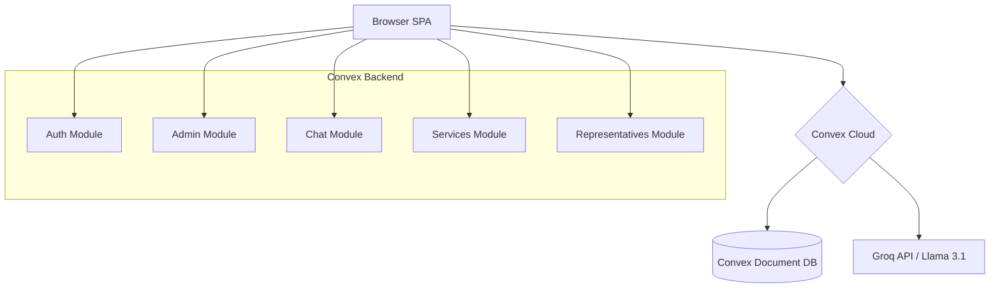

# SaloneHub — Sierra Leone Civic Portal

A modern Single-Page Application (SPA) that unifies access to Sierra Leone government services under one digital roof. Citizens can search services, find elected officials, chat with an AI assistant, read news, and administrators can manage the data — all in a secure, role-aware environment.

---

## Features

| Feature                   | Description                                                                                                                                              |
| ------------------------- | -------------------------------------------------------------------------------------------------------------------------------------------------------- |
| **Service Directory**     | Browse & search government services by agency, region, or keyword. Each service lists fees, required documents, processing times, and official contacts. |
| **Representative Finder** | Locate Members of Parliament and Local Councillors by district, role, or name. Contact details included.                                                 |
| **AI Chat Assistant**     | Ask questions about government services in plain English/Krio/Mende/Temne. Powered by Groq (Llama 3.1 8B) with a Sierra Leone–trained system prompt.     |
| **News Section**          | Placeholder for government announcements and civic news.                                                                                                 |
| **Admin Dashboard**       | CRUD management for services and representatives. Only visible to users with admin privileges.                                                           |
| **Authentication**        | Email/password sign-in/sign-up + anonymous sign-in via Convex Auth.                                                                                      |
| **Role-Based Access**     | Admin users are managed via an `admins` table; the ⚙️ admin button only renders for admin users.                                                         |
| **Multi-Language**        | English, Krio, Mende, and Temne — switched via a language selector in the header.                                                                        |
| **Dark Mode**             | Light / Dark / System theme toggled from the header.                                                                                                     |
| **Responsive Design**     | Mobile-first with adaptive cards, sticky header, scrollable tabs, and a `no-scrollbar` utility.                                                          |

---

## Tech Stack

| Layer              | Technology                                                          |
| ------------------ | ------------------------------------------------------------------- |
| **Frontend**       | React 19, TypeScript, Tailwind CSS 3, Framer Motion                 |
| **Backend**        | Convex (serverless reactive platform — queries, mutations, actions) |
| **Database**       | Convex (document store with indexes & full-text search)             |
| **Authentication** | `@convex-dev/auth` — Password + Anonymous providers                 |
| **AI**             | Groq API (Llama 3.1 8B, OpenAI-compatible SDK)                      |
| **i18n**           | i18next + react-i18next + browser language detector                 |
| **Build**          | Vite 6, TypeScript 5.7, PostCSS, Autoprefixer                       |
| **Linting**        | ESLint 9, Prettier                                                  |

---

## Architecture



- **No traditional REST API** — all data flows through Convex's reactive queries, mutations, and actions.
- **No URL routing** — navigation uses React state (`activeTab`) instead of react-router.
- **Authentication state** is managed by `<ConvexAuthProvider>` with automatic token refresh.

---

## Project Structure

```
salonehub/
├── convex/                        # Backend — Convex functions
│   ├── _generated/                # Auto-generated type bindings (do not edit)
│   ├── auth.ts                    # Convex Auth configuration (Password + Anonymous)
│   ├── auth.config.ts             # Auth provider domain config
│   ├── admin.ts                   # isAdmin, listUsers, grantAdmin, revokeAdmin, seedUsers
│   ├── chat.ts                    # sendMessage (action), saveMessage, getChatHistory
│   ├── clear.ts                   # clearAll mutation (wipes services & reps)
│   ├── http.ts                    # HTTP route wiring (auth routes)
│   ├── router.ts                  # HTTP router (custom endpoints)
│   ├── schema.ts                  # Database schema definition
│   ├── seed.ts                    # Seed data — services + representatives
│   ├── services.ts                # getAllServices, searchServices, getAgencies, CRUD
│   ├── representatives.ts         # searchRepresentatives, getDistricts, getRoles, CRUD
│   └── tsconfig.json              # Convex TypeScript config
│
├── src/                           # Frontend — React SPA
│   ├── App.tsx                    # Root component: header, auth, tabs, tour modal
│   ├── main.tsx                   # Entry point: React root + ConvexAuthProvider
│   ├── index.css                  # Tailwind base + custom CSS variables + utilities
│   ├── i18n.ts                    # i18next initialization (EN, Krio, Mende, Temne)
│   ├── SignInForm.tsx             # Email/password + anonymous sign-in form
│   ├── SignOutButton.tsx          # Sign-out button (hidden when unauthenticated)
│   ├── vite-env.d.ts              # Vite environment type declarations
│   ├── components/
│   │   ├── AdminDashboard.tsx      # Admin CRUD for services & representatives
│   │   ├── ChatInterface.tsx       # AI chat UI (message bubbles, input, auto-scroll)
│   │   ├── Footer.tsx              # App footer
│   │   ├── LanguageSwitcher.tsx    # Language dropdown (EN/KR/MD/TM)
│   │   ├── LiquidBackground.tsx    # Animated liquid gradient background
│   │   ├── MobileMenu.tsx          # Mobile responsive menu
│   │   ├── Modal.tsx               # Reusable modal component
│   │   ├── NewsSection.tsx         # News placeholder tab
│   │   ├── RepresentativeFinder.tsx # Search/filter representatives
│   │   ├── ServiceDirectory.tsx    # Search/filter government services
│   │   └── ThemeToggle.tsx         # Light / Dark / System toggle
│   ├── hooks/
│   │   └── useTheme.ts             # Theme state with localStorage persistence
│   ├── i18n/
│   │   └── locales/                # (imported via i18n.ts)
│   └── lib/
│       └── utils.ts                # `cn()` — clsx + tailwind-merge utility
│
├── locales/                       # Translation JSON files
│   ├── en.json                    # English
│   ├── kr.json                    # Krio
│   ├── md.json                    # Mende
│   └── tm.json                    # Temne
│
├── .env.local                     # Convex deployment credentials (VITE_CONVEX_URL)
├── tailwind.config.js            # Tailwind config with custom breakpoints, colors, animations
├── vite.config.ts                 # Vite config with @ path alias
├── tsconfig.json                  # Root TypeScript config
├── tsconfig.app.json              # App-specific TS config
├── tsconfig.node.json             # Node-specific TS config
├── package.json                   # Dependencies and scripts
├── postcss.config.cjs             # PostCSS config (Tailwind, Autoprefixer)
├── eslint.config.js               # ESLint flat config
├── components.json                # Shadcn/ui component registry (minimal usage)
└── setup.mjs                      # Setup script
```

---

## Database Schema

Seven application tables plus seven system auth tables:

| Table                     | Purpose                     | Key Indexes                                                    |
| ------------------------- | --------------------------- | -------------------------------------------------------------- |
| **services**              | Government services catalog | `by_agency`, `by_region`, `search_services` (full-text)        |
| **representatives**       | MPs and Local Councillors   | `by_district`, `by_role`, `search_representatives` (full-text) |
| **chatMessages**          | AI chat history             | `by_session`, `by_user`                                        |
| **admins**                | Admin user IDs              | `by_userId`                                                    |
| **users**                 | User accounts (auth)        | `email`, `phone`                                               |
| **authAccounts**          | Auth provider accounts      | `providerAndAccountId`, `userIdAndProvider`                    |
| **authSessions**          | Auth sessions               | `userId`                                                       |
| **authRefreshTokens**     | Token refresh tracking      | `sessionId`                                                    |
| **authVerificationCodes** | Email/phone verification    | `accountId`, `code`                                            |
| **authRateLimits**        | Rate limiting               | `identifier`                                                   |
| **authVerifiers**         | Cryptographic verifiers     | `signature`                                                    |

### Services table

```ts
{
  name: string;              // e.g. "Voter Registration"
  agency?: string;           // e.g. "ECSL"
  fee?: string;              // e.g. "NLe 0"
  processingTime?: string;   // e.g. "2 days"
  documents?: string[];      // e.g. ["National ID", "Birth certificate"]
  eligibility?: string;
  processSteps?: string[];
  locations?: string[];
  contacts?: string;
  notes?: string;            // Fraud warnings
  lastVerified?: string;
  region?: string;
  ministry?: string;
  category?: string;
  description?: string;
  requirements?: string[];
  officialFees?: string;
  contactInfo?: string;
  websiteUrl?: string;
}
```

### Representatives table

```ts
{
  name: string;
  role?: string;          // "Member of Parliament" | "Local Council"
  district: string;
  constituency?: string;
  phone: string;
  email: string;
  title?: string;
  ministry?: string;
  office?: string;
  officeAddress?: string;
}
```

### Admins table

```ts
{
  userId: Id<"users">; // References the auth users table
}
```

---

## Backend API — Convex Functions

### Admin (`convex/admin.ts`)

| Function      | Type     | Auth   | Description                                                                       |
| ------------- | -------- | ------ | --------------------------------------------------------------------------------- |
| `isAdmin`     | query    | Public | Returns `true` if caller's userId is in `admins` table                            |
| `listUsers`   | query    | Admin  | Lists all users with their email, name, and `isAdmin` status                      |
| `grantAdmin`  | mutation | Public | Adds a userId to the `admins` table                                               |
| `revokeAdmin` | mutation | Public | Removes a userId from the `admins` table                                          |
| `seedUsers`   | action   | Public | Creates 3 test accounts via `createAccount`; grants admin to `admin@salonehub.sl` |

### Auth (`convex/auth.ts`)

| Function          | Type   | Description                                 |
| ----------------- | ------ | ------------------------------------------- |
| `signIn`          | action | Password provider sign-in / sign-up         |
| `signOut`         | action | Sign out                                    |
| `store`           | action | Token store                                 |
| `isAuthenticated` | query  | Checks if caller has a valid session        |
| `loggedInUser`    | query  | Returns the current user document (or null) |

### Chat (`convex/chat.ts`)

| Function         | Type     | Description                                                       |
| ---------------- | -------- | ----------------------------------------------------------------- |
| `sendMessage`    | action   | Sends message to Groq AI, saves conversation; 5-second rate limit |
| `saveMessage`    | mutation | Persists a chat message to the database                           |
| `getChatHistory` | query    | Returns all messages for a sessionId (ascending)                  |
| `getLastMessage` | query    | Returns the most recent message for rate-limit checks             |

### Services (`convex/services.ts`)

| Function         | Type     | Description                                               |
| ---------------- | -------- | --------------------------------------------------------- |
| `getAllServices` | query    | All services                                              |
| `searchServices` | query    | Full-text search by name + optional agency/region filters |
| `getAgencies`    | query    | Distinct list of agency names                             |
| `createService`  | mutation | Insert a new service                                      |
| `deleteService`  | mutation | Delete a service by ID                                    |

### Representatives (`convex/representatives.ts`)

| Function                | Type     | Description                                               |
| ----------------------- | -------- | --------------------------------------------------------- |
| `getAllRepresentatives` | query    | All representatives                                       |
| `searchRepresentatives` | query    | Full-text search by name + optional district/role filters |
| `getDistricts`          | query    | Distinct list of districts                                |
| `getRoles`              | query    | Distinct list of roles                                    |
| `createRepresentative`  | mutation | Insert a new representative                               |
| `deleteRepresentative`  | mutation | Delete a representative by ID                             |

### Seed & Clear

| Function    | File              | Type     | Description                                                     |
| ----------- | ----------------- | -------- | --------------------------------------------------------------- |
| `seed`      | `convex/seed.ts`  | mutation | Inserts 10 services + 20 representatives (skips if data exists) |
| `seedUsers` | `convex/admin.ts` | action   | Creates 3 test user accounts with passwords                     |
| `clearAll`  | `convex/clear.ts` | mutation | Deletes all services and representatives                        |

---

## Authentication & Authorization

### Flow

1. **Sign-up:** User submits email + password → Convex Auth creates a record in `users` + `authAccounts` tables with Scrypt-hashed password.
2. **Sign-in:** User submits email + password → Convex Auth verifies hash → session cookie issued.
3. **Anonymous:** One-click sign-in without credentials (for browsing).
4. **Admin check:** `api.admin.isAdmin` queries the `admins` table for the current userId. Returns `true`/`false`.
5. **UI gating:** The `<IsAdmin>` component in `App.tsx` conditionally renders the admin panel button. Non-admin users who manually navigate to the admin tab see "Access Denied" within `AdminDashboard.tsx`.

### Admin Users

Admin status is stored in the `admins` table (userId only, no hardcoded emails). To grant admin to an existing user:

```bash
# Get the user's ID (must be authenticated as admin in the browser, then:)
npx convex run admin:listUsers

# Grant admin (replace with actual userId from the list)
npx convex run admin:grantAdmin --args '{"userId":"k97etk6mmc96h9hgedw0vm2wfs88erfg"}'
```

### Test Accounts (seeded)

| Email                | Password   | Role         |
| -------------------- | ---------- | ------------ |
| `admin@salonehub.sl` | `admin123` | Admin        |
| `alice@test.com`     | `test123`  | Regular user |
| `bob@test.com`       | `test123`  | Regular user |

---

## Internationalization

Four languages supported via i18next:

| Code | Language | File              |
| ---- | -------- | ----------------- |
| `en` | English  | `locales/en.json` |
| `kr` | Krio     | `locales/kr.json` |
| `md` | Mende    | `locales/md.json` |
| `tm` | Temne    | `locales/tm.json` |

The language selector persists the choice in `localStorage`. Detection order: `localStorage` → browser language → HTML `lang` attribute.

---

## Development Setup

### Prerequisites

- Node.js >= 18
- npm >= 9
- A Convex account (free at https://convex.dev)
- (Optional) A Groq API key for AI chat: `GROQ_API_KEY` in `.env.local`

### Quick Start

```bash
# 1. Install dependencies
npm install

# 2. Start Convex (logs in via browser, creates a deployment)
npx convex dev

# 3. Seed the database with data
npx convex run seed:seed
npx convex run admin:seedUsers

# 4. Start the development server
npm run dev
```

The app opens at `http://localhost:5173`.

### Available Scripts

| Command                          | Description                                               |
| -------------------------------- | --------------------------------------------------------- |
| `npm run dev`                    | Starts both Vite dev server and Convex dev in parallel    |
| `npm run build`                  | TypeScript type check + Vite production build             |
| `npm run lint`                   | Full lint pipeline: Convex types + app types + Vite build |
| `npx convex dev`                 | Start Convex in dev mode (watching `convex/` for changes) |
| `npx convex run <function>`      | Run a Convex function from the CLI                        |
| `npx convex run seed:seed`       | Populate services & representatives                       |
| `npx convex run admin:seedUsers` | Create 3 test user accounts                               |
| `npx convex run clear:clearAll`  | Wipe all services & representatives                       |

### Environment Variables (`.env.local`)

| Variable            | Description                                      |
| ------------------- | ------------------------------------------------ |
| `CONVEX_DEPLOYMENT` | Auto-generated by `npx convex dev`               |
| `VITE_CONVEX_URL`   | Your Convex deployment URL                       |
| `GROQ_API_KEY`      | (Optional) Groq API key for AI chat              |
| `OPENAI_API_KEY`    | (Optional) Fallback if `GROQ_API_KEY` is not set |

---

## Switching to Your Own Convex Account

```bash
npx convex logout                # Sign out of current account
rm .env.local                    # Remove old deployment config
npx convex dev                   # Log in with your account → creates new deployment
npx convex run seed:seed         # Seed services & representatives
npx convex run admin:seedUsers   # Seed test user accounts
```

---

## Production Build

```bash
npm run build
```

Output is in `dist/`. Deploy `dist/` to any static hosting (Vercel, Netlify, Cloudflare Pages, etc.). The Convex backend is hosted by Convex Cloud.

---

## Key Design Decisions

1. **No URL routing** — The app uses React state (`activeTab`) for navigation. This avoids the complexity of route guards while keeping the SPA simple. The admin panel is a "tab" like any other, gated by the `isAdmin` query.
2. **Reactive data** — Convex queries automatically re-run when underlying data changes. The UI always reflects the current database state without manual refetching.
3. **AI via action** — The `sendMessage` function is a Convex action (not mutation) because it calls an external API (Groq). It orchestrates the API call and then calls a mutation to persist the conversation.
4. **Admin via separate table** — Instead of encoding roles in the auth user document (which would require schema changes to the auth tables), a dedicated `admins` table stores userId references. This keeps auth configuration clean and role management explicit.
5. **Scrolling chat** — The chat auto-scroll uses `scrollTop` on a container ref rather than `scrollIntoView` to avoid the "shaking" problem when new messages arrive.

---

## License

This project is developed for educational/demonstration purposes as a civic technology prototype for Sierra Leone.
